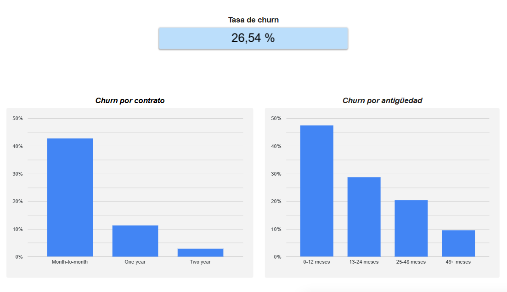

# Telco Churn Analysis — Análisis de retención de clientes

Análisis exploratorio de retención sobre ~7.000 clientes, como preparación
para un rol de Data Analyst en Revenue Operations. El objetivo es identificar
los factores que predicen la cancelación de servicio (churn) y traducirlos en
acciones de retención priorizadas.

## Dataset
Telco Customer Churn (IBM, vía Kaggle) — ~7.043 clientes con información de
contrato, antigüedad (tenure), cargos mensuales y totales, servicios
contratados y estado de cancelación.
Montado en BigQuery; los tipos de dato se sanean en una vista (`telco_clean`),
incluyendo el casteo de `TotalCharges` (que llega como texto por valores en blanco).

## Herramientas
- **BigQuery** — almacenamiento y saneamiento de datos.
- **Python (Pandas, Seaborn, Matplotlib)** — análisis exploratorio en `eda_churn_telco.ipynb`.
- **Looker Studio** — dashboard de churn para público no técnico.

## Análisis
El notebook [`eda_churn_telco.ipynb`](eda_churn_telco.ipynb) reconstruye los
principales factores de cancelación mediante análisis exploratorio y
visualizaciones:

| Factor analizado | Técnica | Hallazgo |
|---|---|---|
| Tasa de churn global | Distribución de frecuencias | ~27% de los clientes cancelan |
| Tipo de contrato | Tasa de churn por grupo | Mes a mes con el 42,71%|
| Antigüedad (tenure) | Histograma segmentado | El churn se concentra en los primeros 12 meses |
| Cargos mensuales | Boxplot comparativo | Quienes cancelan tienen cargos más altos |

## Acciones de retención sugeridas
A partir de los hallazgos, las intervenciones priorizadas serían:
- **Migración de contratos:** incentivar el paso de month-to-month a planes
  anuales, el segmento de menor churn.
- **Onboarding temprano reforzado:** acompañamiento en los primeros meses,
  donde se concentra la cancelación.
- **Revisión de precios:** analizar la relación valor-precio en los clientes
  de cargos altos.

## Dashboard de churn
Vista interactiva orientada a público no técnico, con la tasa de churn global
y su desglose por contrato y antigüedad.

[Ver dashboard en Looker Studio](https://datastudio.google.com/reporting/aa1ce6f3-a8ad-481e-97cc-2d4e998c8764)

